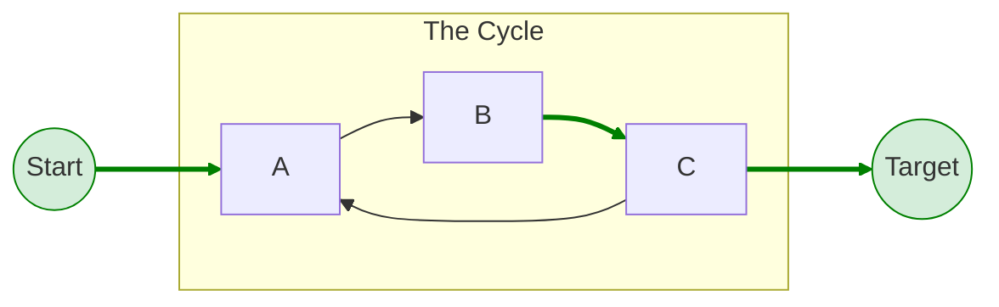
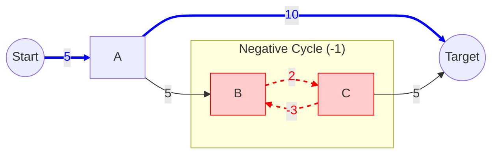

As part of a project finding arbitrage opportunities in crypto I ended up investigating ESPPRC, which stands for Elementary Shortest Path Problem with or without Resource Constraint.

## Mathematics

In graph theory, an **elementary path** (often called a simple path) is defined specifically as a path that does not repeat any vertices.

Therefore, the **Shortest Elementary Path Problem** is the path with the minimum total weight between two nodes subject to the constraint that no node is visited more than once.

In graph theory, the <strong>shortest elementary path problem</strong> requires that each node in a path can only be visited once. The edge weights do not need to be nonnegative.

A general algorithm to solve this problem works by solving the k-paths problem, i.e. by solving the nonelementary problem repeatedly and requiring that for the nodes that are present in nonelementary paths multiple (k) paths need to be found. The resulting algorithm finds the elementary shortest paths (ESPP) from a single source to all destinations [1]. However, it can be very slow if very large graphs are considered. Especially because the algorithm in [1] is intrinsically flawed and the fix for this makes it much less efficient than expected: See note in ESPP.py.

A more powerful algorithm can be used when additionally there are positive resources associated to each edge in the graph, though this requirement can be relaxed to nonnegative resources if not too many edges have zero resource cost associated to them. The resulting Elementary Resource Constrained Shortest Path Problem (ESPPRC) can then be solved by an algorithm that starts by first preprocessing the graph [2]. During preprocessing, the graph is first pruned by discarding all nodes that cannot be reached from the origin or reach the target without violating the resource limits. Subsequently, for each pair in the resulting pruned graph, the least-cost path is sought, which will be used later to incrase so-called dominance of paths by other paths.

After preprocessing, the ESPPRC is solved by introducing node-resources that count how many times a node has been used in a certain path, so that elementarity can be enforced. As this problem can quickly become exponential in nature, it is critical that the numer of resource nodes that have to be introdcuced kept as low as possible. In the algorithm this is done by using a two-fold dominance strategy: On the one hand, paths are only added to the list of possible shortest possible paths, if their resource consumption is not dominated by another path. Also, when a path is added, the other possible paths that are dominated by it, are discarded. On the other hand, strong dominance is a mathematical trick that is used to speed up convergence to the shortest path, by artificially incrementing possible node resources of nodes that cannot be reached [2]. The resulting algorithm seeks the ESPPRC for single source to single destination problems.

UNDER CONSTRUCTION