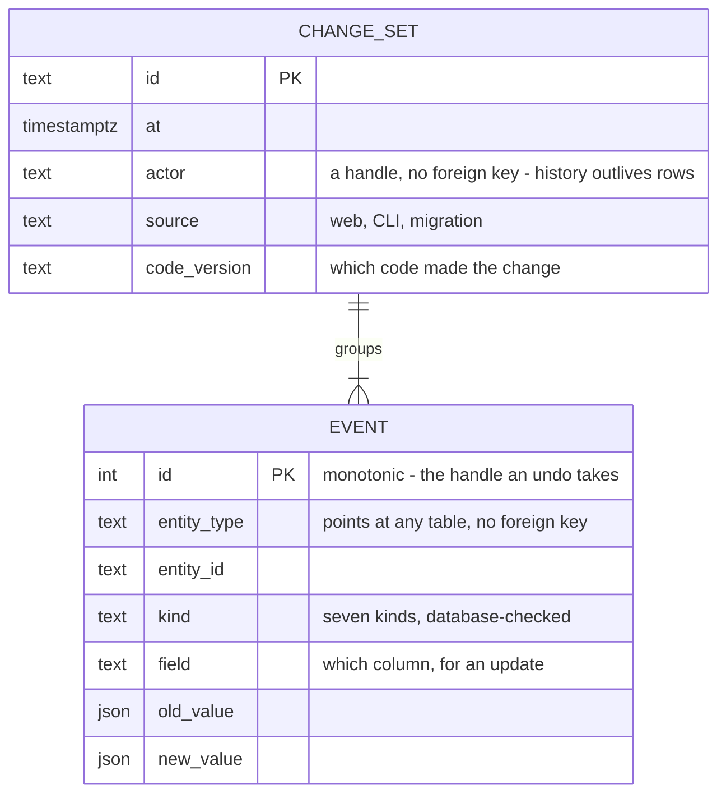

*Always be building. This is part 2 of a series of three about sales tools that you build and do not buy.*

I built a production web application, and I did not read even one line of its code.
The code exists: a FastAPI application, a Postgres database, more than thirty migrations, a Slack app, a command-line tool, backups, monitors.
I never opened a file, on purpose.

This is not what people call vibe coding.
Vibe coding accepts whatever runs.
I accepted only what I could verify from the outside, and I refused the rest.
The AI agent (Claude Code) was the contractor.
I was the client with a precise specification and a hard acceptance test.
That is the same job we normally do with human contractors.
The code quality seems to be good enough to pass all my tests, which is probably similar to what you get from human contractors.
The difference is the speed of the loop.

## The loop

Every change follows the same five steps.

First, I write the work item as prose in an issue: the problem, the rule I want, and how I will know that it works.
The agent reads it and argues back.
We go a few rounds until the plan converges, and the plan lives in the issue, not in a chat window.
Often, especially for UI features, I get a few mockups as well for me to choose from.
I make sure to use one of the better agents for this, e.g. Claude Opus, or, if it's an important or large work item, Fable.
(This will probably age badly. Human from the future: These were considered state of the art at the time of writing.)

Second, the agent builds on an isolated branch in a git worktree with its own copy of the database.
Nothing it does can touch production, by design.

Third, it runs the test suite, which currently takes about five minutes, and then it automatically starts a rehearsal:
It pulls a fresh copy of the live data, opens every page the change touches, and reads the server log. 

Fourth, it opens a merge request with a description written for a human.
I read the description, I click through the rehearsed application, and I approve the merge myself.
That is my rule, and it is the one rule that I never relaxed.
The agent handles potential merge conflicts, which can occur if multiple agents are working on features at the same time.
One of the most useful ways to avoid problems is to adhere strictly to Alembic data schema versioning, so that features which touch the same data cannot be merged without a data migration, typically including a rebase of the later branches onto the ones that go before it.
More information about that below.

Fifth, the change deploys and the monitors watch it.

This is the process in a nutshell.
I think that many of the components can be swapped out, but that the overall structure is pretty solid.

## What I look at instead of code

### The schema page
Since my [time in academia](https://pb3d.github.io/) working on HPC code in Fortran, carefully planning memory layout of all my variables, avoiding memory leaks and out-of-memory problems, and manually designing optimized OpenMP and MPI parallelization strategies, I have come to believe that the data structure behind the scenes is the basis of everything.
I think the same holds for web apps.
It follows, then, that the UI is just a slightly more ephemeral shell on top of the data.
It makes a lot of sense, therefore, to be very meticulous with the data schema, and a little bit less so for the UI: 
In other words, a UI bug doesn't hurt as much as a badly designed data schema.

The engine, as I call my web app, visually renders its own schema in detail and in an aesthetically pleasing way: every table, its row count, its unreferenced rows, when it last changed, and whether the audit trail covers it.
This is the page that I open after every change.
It once showed a box that read "empty, 0 unreferenced, no trail entries" next to sixteen tables full of rows.
That box was a table that nothing read any more.
I had an agent investigate it, and delete it afterwards.
Part 3 shows this schema in detail.

### The rehearsal
A green test suite once hid a traceback on every page load.
The suite tested the functions; the pages needed the functions in a different order.
Since then, no change ships without a click-through on a copy of the live data, with the server log open.
Every bug that still reached production came from a rehearsal that differed from production in exactly one detail.
So the copy is exact now: same database engine, same data, same sign-in path.

### The migrations
Every change to the schema is a numbered, reversible step with a written explanation of why.
I read the explanation, never the SQL.
Two checks keep the steps honest:
One command compares the code's picture of the schema with the real database and must find nothing to say.
One test builds a database from the steps, builds another from the code, and compares them column by column.

### The unified access to data
Every change to the data goes through the application.
Nobody writes SQL directly: not me, not the agent, not a script.
So every change carries who made it, when, through which "door" as I call it (web, CLI, migration), and which version of the code.
A change without an author is unwritable, and any change can be undone from the trail.
This is what the audit part of the schema looks like:

### The monitors
An open-source error tracker (GlitchTip) collects every exception with its stack trace.
Each scheduled job reports to a heartbeat monitor when it runs.
There is also an alarm that fires on silence designed to catch a job that never started, which is useful for the automatic backup strategy that the app has in place.

## The stack

For the engineers, the checklist of what production means here:

- Hosting: one small VPS in Europe (Hetzner), one Linux box, a few euros each month.
- Sign-in: Google sign-in through oauth2-proxy, limited to the accounts of our own Workspace. Two roles, readers and editors, named in one line of configuration.
- Three doors: the browser (the proxy puts the signed-in address in a header), the command line for development (locked by SSH to the box), and an API token for CLI production usage.
- Database: Postgres. I started on SQLite in an early prototype and moved before the second user arrived.
- Migrations: Alembic, more than thirty numbered steps, each with its prose.
- Backups: scheduled, each run reporting to a heartbeat.
- Monitoring: GlitchTip for errors, heartbeats for the jobs.
- Application: FastAPI, server-rendered pages, one stylesheet.
- Beside it: a Slack app for the daily digests, and a command-line tool for bulk work and recovery.
- Source: a self-hosted GitLab, one merge request per change, merged by a human.

## The skill

What did I actually do, if not programming?
I wrote what I wanted, in sentences a colleague could check.
I split big wishes into steps that each have a test.
I said no, often: the most useful sentence I wrote was "this is too complicated, fix the cause one layer down".
And I refused to accept "it works" without seeing it work on real data.

Sales operations people already do all four things.
They write requirements for vendors, cut projects into phases, push back on scope, and sign off on acceptance tests.
The AI agent changes one thing only: the answer to a requirement arrives in minutes instead of in the next steering meeting.
That speed is what makes the loop worth running for a tool with a handful of users.

The technical half of my experience helped with the vocabulary.
I know what a foreign key, a migration and a heartbeat are, so I could name what I wanted checked.
I did not need it to read the implementation, because I never did.

## The limits

Where the acceptance test was weak, the bugs came through.
Five bugs reached production, and each came from a rehearsal that was one detail short of the real thing.
The fix each time was a more exact rehearsal, not a look at the code.

Three things I never skipped:
SSO integration before the first real record, backups before the first week, and the audit trail before the first colleague.

And I would still bring in an engineer for two things:
A security review before people outside the company get accounts, and anything that involves money.

## Part 3

The schema is where all of this fit lives:
Every rule above is a rule that the database keeps, and every number in a digest traces to a column with a name.
Part 3 shows the schema itself, and what it makes possible: the digests, the generated messages, the slide decks.

*Part 3 comes next. It shows the data schema and what it feeds.*
